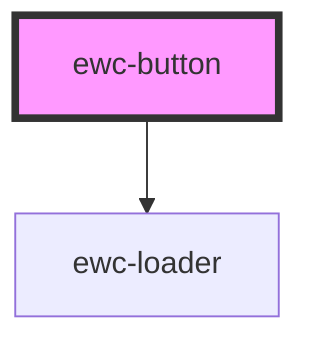

# ewc-button

<!-- Auto Generated Below -->

## Properties

| Property   | Attribute  | Description                           | Type                                        | Default     |
| ---------- | ---------- | ------------------------------------- | ------------------------------------------- | ----------- |
| `disabled` | `disabled` | If the button is disabled             | `boolean`                                   | `false`     |
| `label`    | `label`    | The label of the button               | `string`                                    | `undefined` |
| `loading`  | `loading`  | If the button is loading              | `boolean`                                   | `false`     |
| `srHint`   | `sr-hint`  | The screen reader hint for the button | `string`                                    | `undefined` |
| `theme`    | `theme`    | The appearance of the button          | `"primary" \| "secondary" \| "transparent"` | `'primary'` |
| `type`     | `type`     | The type of the button                | `"button" \| "reset" \| "submit"`           | `'button'`  |

## Methods

### `doFocus() => Promise<void>`

Focuses the button

#### Returns

Type: `Promise<void>`

## Dependencies

### Depends on

- [ewc-loader](../ewc-loader)

### Graph

----------------------------------------------

*Built with [StencilJS](https://stenciljs.com/)*
