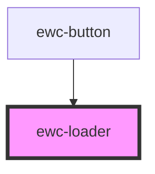

# ewc-loader

<!-- Auto Generated Below -->

## Properties

| Property        | Attribute        | Description                                            | Type      | Default             |
| --------------- | ---------------- | ------------------------------------------------------ | --------- | ------------------- |
| `size`          | `size`           | The size of the loader                                 | `number`  | `this.baseWidth`    |
| `srHint`        | `sr-hint`        | The screen reader hint for the loader                  | `string`  | `'status: Loading'` |
| `strokeInherit` | `stroke-inherit` | If the loader inherits the color of the parent element | `boolean` | `false`             |

## Dependencies

### Used by

 - [ewc-button](../ewc-button)

### Graph

----------------------------------------------

*Built with [StencilJS](https://stenciljs.com/)*
